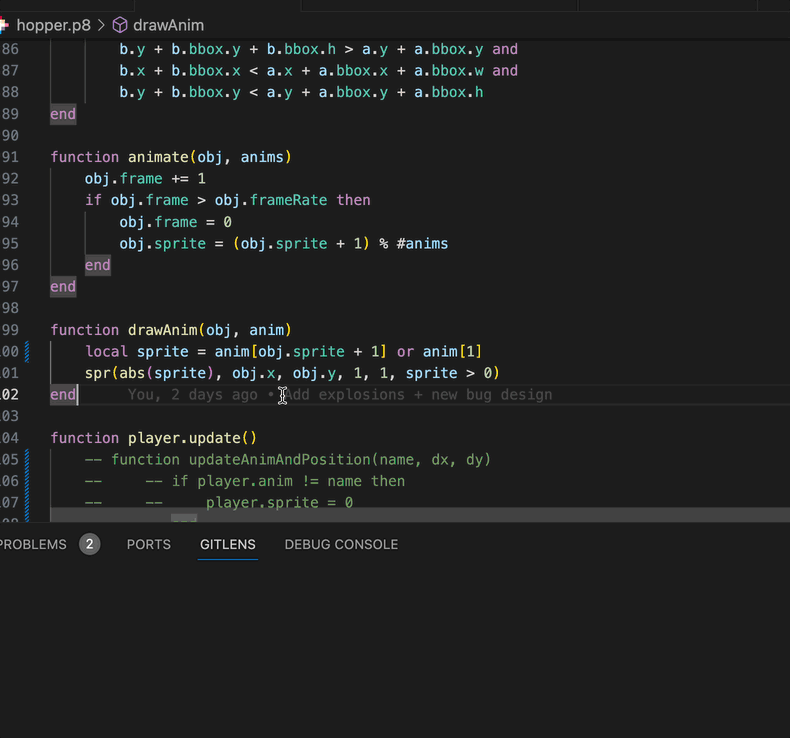

# Hello Pico

Ce projet est donné comme une base pour démarrer un projet Pico 8 avec VSCode simplement.

## Installation

1. Installe pico8 dans tes applications et vérifie que l'app se lance correctement.

2. Tu peux télécharger le zip du projet ou le cloner avec la commande :

```bash
git clone git@github.com:jeremt/hello-pico.git
```

3. Ouvre le projet dans VSCode

```bash
code hello-pico
```

4. Installe les extensions recommandées

## Tester

Pour executer ouvre un des fichiers .p8 puis utilise `⌘+⇧+P` et choisi `Run a pico8 file`.



## Resources

-   [Vidéo d'intro sur lua 👩‍💻](https://www.youtube.com/watch?v=jUuqBZwwkQw)
-   [Bibliothèue de sprites 🎨](https://nerdyteachers.com/PICO-8/Sprites/library.php)
